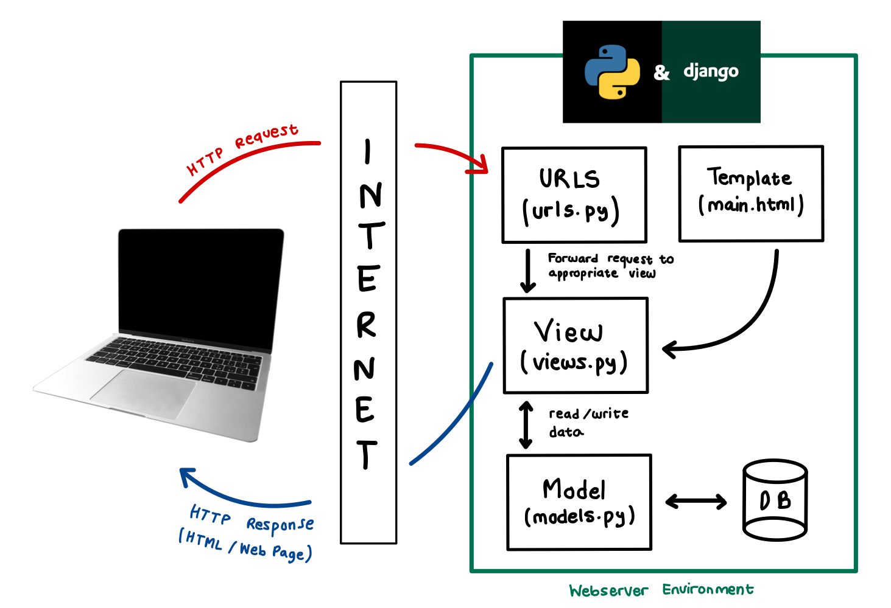
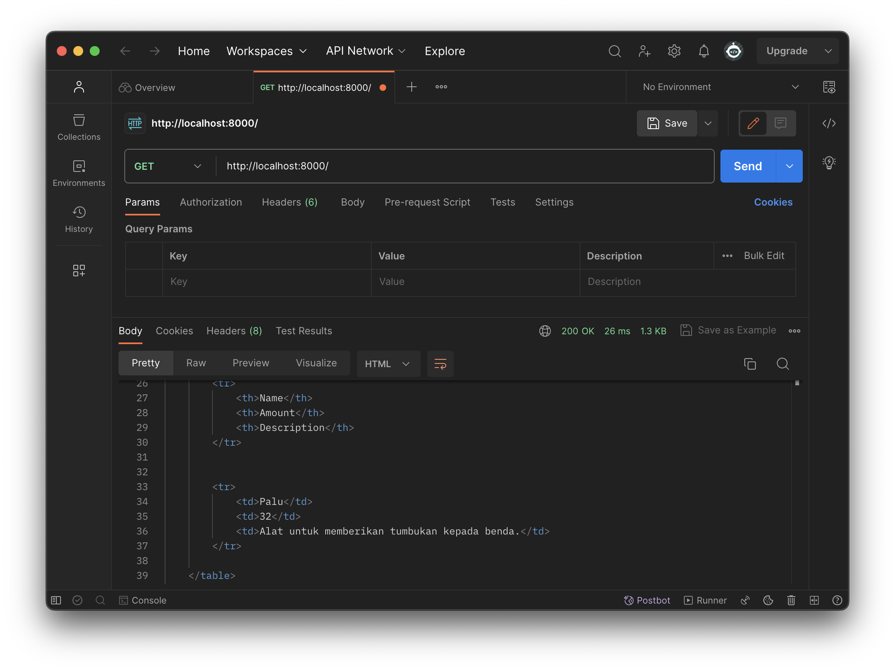
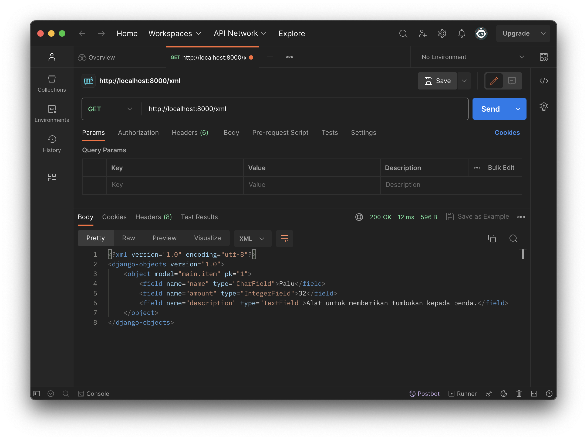
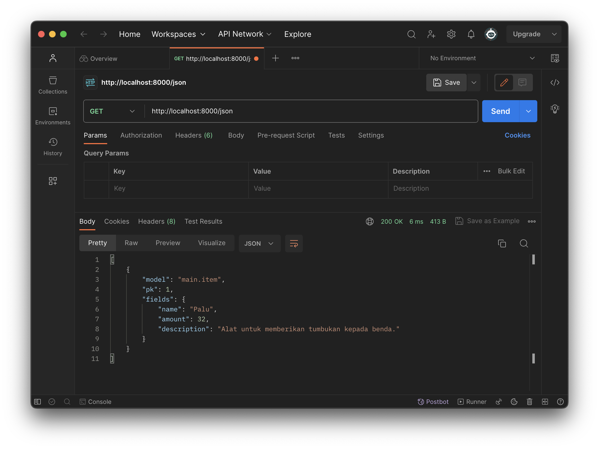
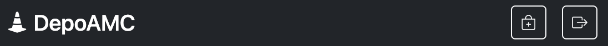
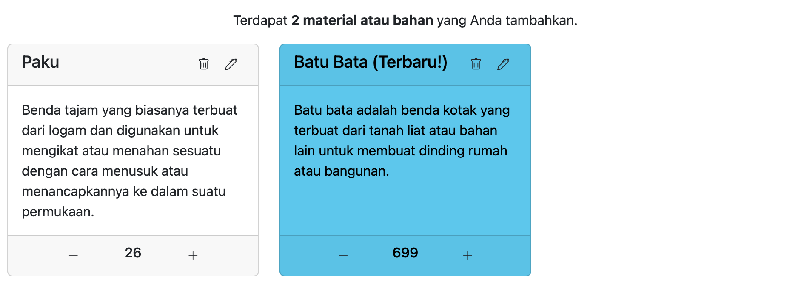
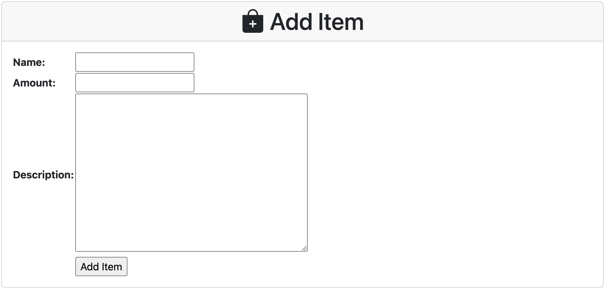

# depoAMC

**Tugas - Pemrograman Berbasis Platform - Kelas PBP D**
> **depoAMC** adalah aplikasi pengelolaan penyimpanan berbagai macam bahan dan perlengkapan yang diperlukan untuk proyek konstruksi, renovasi, perbaikan, atau pembangunan properti.

## 👷🪓🪚 **Laman** 🚜⛏️🦺🔨
[Klik disini untuk mengunjungi laman DepoAMC!](http://akmal-ramadhan21-tugas.pbp.cs.ui.ac.id/)

<details>
<summary> <b> Tugas 2: Implementasi Model-View-Template (MVT) pada Django </b> </summary>

## **Implementasi Aplikasi**
* ### Membuat proyek Django
Pertama, saya membuat direktori dan menyiapkan *dependencies* pada `requirements.txt` untuk menyiapkan proyek Django.

Berikut adalah isi dari berkas `requirements.txt`.
```
django
gunicorn
whitenoise
psycopg2-binary
requests
urllib3
```
Install *dependencies* tersebut dengan perintah `pip install -r requirements.txt` pada *virtual environment*. Setelah itu, proyek dibuat dengan menjalankan perintah `django-admin startproject depoAMC .` dan mengunggahnya ke repositori GitHub baru.

* ### Membuat aplikasi `main`
Pada direktori `depoAMC`, aktifkan *virtual environment* dan membuat aplikasi baru bernama `main` dengan perintah `python manage.py startapp main`. Daftarkan `main` ke dalam proyek dengan menambahkan `'main'` pada variabel `INSTALLED_APPS` yang berada di berkas `settings.py`.
```python
INSTALLED_APPS = [
    ...,
    'main',
    ...
]
```

* ### Membuat model aplikasi `main`
Model adalah bagian yang berhubungan dengan _database_. Pada berkas `models.py` di direktori `main`, saya mendefinisikan model sederhana baru dengan kode berikut ini.
```python
from django.db import models

# Create your models here.
class Item(models.Model):
    name = models.CharField(max_length=255)
    amount = models.IntegerField()
    description = models.TextField()
```
Tidak lupa untuk melakukan migrasi model dengan perintah `python manage.py makemigrations` dan menerapkannya ke *database* lokal dengan perintah `python manage.py migrate`.

* ### Membuat dan Menghubungkan Fungsi `views.py` dengan Template
Akan dilakukan *rendering* tampilan HTML dengan menggunakan data yang diberikan. Pada berkas `views.py` tambahkan `import render` dan fungsi `show_main` untuk menampilkan halaman `main.html` dengan kode dibawah ini.
```python
from django.shortcuts import render

def show_main(request):
    context = {
        'name': 'Akmal Ramadhan',
        'class': 'PBP - D'
    }

    return render(request, "main.html", context)
```
Pada `main.html`, saya meletakkan variabel yang dapat digantikan oleh data yang telah diambil dari model seperti dibawah ini.
```python
<p><b>Nama: </b>{{ name }}</p>
<p><b>Kelas: </b>{{ class }}</p>
```

* ### Melakukan *routing* aplikasi `main`
Untuk mengatur URL pada aplikasi `main`, saya membuat berkas `urls.py` pada aplikasi `main` yang berisikan kode berikut ini.
```python
from django.urls import path
from main.views import show_main

app_name = 'main'

urlpatterns = [
    path('', show_main, name='show_main'),
]
```
Agar URL proyek (`depoAMC`) dapat mengimpor URL aplikasi (`main`)
, maka pada berkas `urls.py` di `depoAMC` saya tambahkan fungsi `include` dari `django.urls` dan menambahkan URL ke tampilan `main` di dalam variabel `urlpatterns`.
```python
...
from django.urls import path, include
...

urlpatterns = [
    ...
    path('main/', include('main.urls')),
    ...
]
```
Dengan begitu, saya dapat melihat halaman `main` dengan perintah `python manage.py runserver` di [http://localhost:8000/main/](http://localhost:8000/main/)

* ### Melakukan *deployment* ke Adaptable
Langkah terakhir, saya melakukan *deploy* ke Adaptable dengan memilih `Python App Template` sebagai *template deployment* dan `PostgreSQL` sebagai *database type* yang akan digunakan. Pilih versi Python dengan versi lokal dan masukan _command_ `python manage.py && gunicorn DepoAMC.wsgi` pada `Start Command`.

## **Bagan**


Ketika *web browser* menerima permintaan HTTP aplikasi `main` dari pengguna, terjadi URL *mapping* oleh `urls.py`. Setelah _mapping_ selesai dan ditemukan, fungsi pada `views.py` dipanggil sesuai dengan permintaan URL nya. Setelah itu, HTTP *request* ini akan dikembalikan oleh *view* menjadi HTTP *response* berupa HTML *page*. Dalam pengembalian ini, `views.py` akan mengakses data yang dibutuhkan dari `models.py` dan data tersebut ditampilkan menggunakan template `main.html`.

## **Virtual Environment**
Virtual Environment digunakan untuk memisahkan *packages* dan *dependencies* yang berbeda antar proyek dalam satu perangkat yang sama. Misalkan ketika ada dua proyek yang menggunakan versi Python yang berbeda. Dengan _virtual environment_, versi yang berbeda ini tidak saling mempengaruhi kedua proyek satu sama lain.

Kita bisa saja membuat aplikasi web berbasis Django tanpa menggunakan *virtual environment*. Akan tetapi, dapat terjadi risiko konflik *dependencies* antar satu proyek dengan proyek lainnya sehingga proyek yang bangun akan menjadi kacau.

## **MVC, MVT, dan MVVM**
Django menggunakan pola arsitektur MVT (Model-View-Template). Terdapat pola-pola lain seperti MVC dan MVVM.

Model: Mengelola data.

View:  Menerima input dan menampilkan informasi kepada pengguna.

#### 1. MVC (Model-View-Controller)


Controller: Berinteraksi dengan menghubungkan Model dan View sebagai pengatur *app flow* dan pengelola permintaan pengguna.

#### 2. MVT (Model-View-Template)


Template: Mengatur tampilan HTML dan menggunakan data dari Model.

#### 3. MVVM (Model-View-Viewmodel)


Viewmodel: Mengelola interaksi dan penghubung antara Model dan View serta mengubah data dari Model ke format yang dapat ditampilkan oleh View.

Perbedaan ketiga pola ini yaitu:

|                                          MVC                                          |                                               MVT                                                |                                                                          MVVM                                                                           |
|:-------------------------------------------------------------------------------------:|:------------------------------------------------------------------------------------------------:|:-------------------------------------------------------------------------------------------------------------------------------------------------------:|
|                            Input diterima oleh Controller                             |                                     Input diterima oleh View                                     |                                                                Input diterima oleh View                                                                 |
|                       View dan Controller berelasi many-to-many                       |                              View dan Template berelasi one-to-one                               |                                                         View dan Viewmodel berelasi one-to-many                                                         |
| View tidak memiliki referensi ke Controller (panah satu arah dari Controller ke View) | View menyimpan referensi ke Template dan Template bekerja jika dipicu dari View (panah dua arah) | View tidak memiliki referensi ke Model dan sebaliknya. Viewmodel lah yang bertugas menghubungkan View dan Model. Dari sinilah nama Viewmodel digunakan. |

## Referensi
GeeksforGeeks: [Difference Between MVC, MVP and MVVM Architecture Pattern in Android](https://www.geeksforgeeks.org/difference-between-mvc-mvp-and-mvvm-architecture-pattern-in-android/)

Tomy's Blog: [MVC, MVP and MVVM](https://tomyrhymond.wordpress.com/2011/09/16/mvc-mvp-and-mvvm/)

javaTpoint: [Django MVT](https://www.javatpoint.com/django-mvt)

</details>

<details>
<summary> <b> Tugas 3: Implementasi Form dan Data Delivery pada Django </b> </summary>

## Perbedaan antara form `GET` dan form `POST` dalam Django
*Form* adalah cara untuk mengambil data dari pengguna. Data tersebut bisa berupa teks maupun *file*. Terdapat dua metode dalam mengirimkan data dari *browser user* yaitu `GET` dan `POST`.

<p align="center"></p>

| Perbedaan | `GET` | `POST` |
|:--:|--|--|
|**Tujuan**| Mengambil atau membaca data dari Django (*web server*). | Mengirim data ke Django (*web server*). |
|**Penggunaan**| Melakukan pencarian atau menampilkan data. | Membuat, memperbarui, atau menghapus data. |
|**Cara Kerja**| Ketika pengguna mengisi form GET dan mengirimkannya, data yang dimasukkan ke dalam form akan muncul di URL. | Ketika pengguna mengisi form POST dan mengirimkannya, data yang dimasukkan ke dalam form dikirim sebagai bagian dari permintaan HTTP ke server, tetapi tidak muncul di URL |
|**Kode Status**| HTTP 200 (OK) jika berhasil | HTTP 201 jika berhasil |

## Perbedaan Utama antara XML, JSON, dan HTML dalam Konteks Pengiriman Data
| Perbedaan | XML | JSON | HTML |
|--|--|--|--|
| Penggunaan |Digunakan dalam pertukaran data antara sistem yang berbeda dan perlu menggambarkan data yang kompleks dan terstruktur dengan baik | Digunakan dalam pengembangan aplikasi web karena mudah dibaca oleh manusia dan mudah digunakan oleh bahasa pemrograman modern | Digunakan untuk menampilkan konten web sehingga dapat diakses oleh *browser* web |
| Sintaks | Menggunakan *tag* `<>` | Menggunakan *key-value pairs* `{}`, `[]`, dan `:` |  Menggunakan *tag* `<>` |

HTML bukanlah format data seperti XML dan JSON melainkan sebuah bahasa *markup* untuk menampilkan data.

<p align="center"></p>

## JSON sebagai Pertukaran Data antara Aplikasi Web Modern
JSON sering digunakan dalam pertukaran data antara aplikasi web modern karena kelebihan berikut:
1. Format data dan sintaks ringan, ringkas, sederhana, dan mudah dibaca.
2. Cocok untuk berbagai jenis data.
3. Didukung oleh banyak bahasa pemrograman sehingga cocok untuk *development* aplikasi web.

## Implementasi *Data Delivery*
### Membuat input `form`
Untuk mendapatkan data baru yang ingin ditampilkan, maka dapat dibuat `form` untuk menerima input.

1. Pertama, membuat berkas `forms.py` pada direktori `main` dan tambahkan kode berikut ini.

```python
from django.forms import ModelForm
from main.models import Item

class ItemForm(ModelForm):
    class Meta:
        model = Item
        fields = ["name", "amount", "description"]
```

2. Kedua, ubahlah fungsi `show_main` pada `views.py` dengan kode berikut ini.
```python
def show_main(request):
    items = Item.objects.all()

    context = {
        'name': 'Akmal Ramadhan',
        'class': 'PBP - D',
        'items': items,
    }

    return render(request, "main.html", context)
```

### Menambahkan fungsi pada `views`
Kita bisa melihat atau mengembalikan data yang telah dimasukkan melalui `form`. 

#### Format HTML

1. Untuk menerima data, akan dibuat fungsi baru bernama `create_item` pada `views.py` seperti pada kode berikut ini.
```python
from main.forms import Item

def create_item(request):
    form = ItemForm(request.POST or None)

    if form.is_valid() and request.method == "POST":
        form.save()
        return HttpResponseRedirect(reverse('main:show_main'))

    context = {'form': form}
    return render(request, "create_item.html", context)
```

2. Membuat *template* baru untuk tampilan dalam menambahkan *item* baru dengan nama `create_item.html` pada direktori `main/templates`.
```python
 


<h1>Add New Item</h1>

<form method="POST">
    
    <table>
        {{ form.as_table }}
        <tr>
            <td></td>
            <td>
                <input type="submit" value="Add Item"/>
            </td>
        </tr>
    </table>
</form>


```

3. Tampilkan data *item* dalam bentuk tabel dan tambahkan tombol `Add New Item` pada `main.html`.
```python
    <table>
        <tr>
            <th>Name</th>
            <th>Amount</th>
            <th>Description</th>
        </tr>
        
        <p> Terdapat <b> {{ items.count }} material atau bahan </b> yang tersedia. </p>

        
            <tr>
                <td>{{item.name}}</td>
                <td>{{item.amount}}</td>
                <td>{{item.description}}</td>
            </tr>
        
    </table>
    
    <br />
    
    <a href="">
        <button>
            Add New Item
        </button>
    </a>
```

---

Untuk format XML dan JSON, saya akan menambahkan *import* `HttpResponse` dan `serializers` pada `views.py` di folder `main`.

#### Format XML
Tambahkan fungsi `show_xml` yang me-*return* `HttpResponse` berisi data yang sudah di-*serialize* menjadi XML.

```python
def show_xml(request):
    data = Item.objects.all()
    return HttpResponse(serializers.serialize("xml", data), content_type="application/xml")
```

#### Format JSON
Tambahkan fungsi `show_json` yang me-*return* `HttpResponse` berisi data yang sudah di-*serialize* menjadi JSON.

```python
def show_json(request):
    data = Item.objects.all()
    return HttpResponse(serializers.serialize("json", data), content_type="application/json")
```

---

Untuk format XML dan JSON *by* ID, dalam pengambilan hasil *query* tambahkan *filter* dengan ID tertentu saja.

#### Format XML *by* ID
```python
def show_xml_by_id(request, id):
    data = Item.objects.filter(pk=id)
    return HttpResponse(serializers.serialize("xml", data), content_type="application/xml")
```

#### Format JSON *by* ID
```python
def show_json_by_id(request, id):
    data = Item.objects.filter(pk=id)
    return HttpResponse(serializers.serialize("json", data), content_type="application/json")
```
---

### Membuat *routing* URL
Tambahkan kelima *path url* fungsi diatas ke dalam `urlpatterns` pada `urls.py` di folder `main`. Tidak lupa untuk meng-*import*-nya dari `views.py`.

```python
from django.urls import path
from main.views import show_main, create_item, show_xml, show_json, show_xml_by_id, show_json_by_id 

app_name = 'main'

urlpatterns = [
    path('', show_main, name='show_main'),
    path('create-item', create_item, name='create_item'),
    path('xml/', show_xml, name='show_xml'), 
    path('json/', show_json, name='show_json'),
    path('xml/<int:id>/', show_xml_by_id, name='show_xml_by_id'),
    path('json/<int:id>/', show_json_by_id, name='show_json_by_id'),  
]
```

Dengan begitu, input `form` sudah selesai dibuat dan siap digunakan. Jalankan *command* `python manage.py runserver` dan kunjungi <http://localhost:8000>.

## Postman *Screenshot*
Berikut adalah tangkapan layar hasil akses URL melalui Postman untuk tiap kelima URL.
1. HTML

2. XML

3. JSON

4. XML *by* ID

5. JSON *by* ID


## Referensi
Java67: [Difference between GET and POST Request in HTTP and REST APIs](https://www.java67.com/2014/08/difference-between-post-and-get-request.html)

Wikimedia: [JSON vs XML.png](https://commons.wikimedia.org/wiki/File:JSON_vs._XML.png)

PBP Ganjil 23/24: [Tutorial 2](https://pbp-fasilkom-ui.github.io/ganjil-2024/docs/tutorial-2)
</details>

<details>
<summary> <b> Tugas 4: Implementasi Autentikasi, Session, dan Cookies pada Django </b> </summary>

## Django `UserCreationForm`
`UserCreatoinForm` adalah formulir dari modul `django.contrib.auth.forms` yang disediakan oleh Django untuk membuat dan mendaftarkan pengguna baru dalam aplikasi web kita. 
 
| Kelebihan | Kekurangan |
| -- | -- |
| Mudah digunakan | Tidak mendukung banyak kebutuhan autentikasi |
| Memiliki validasi bawaan | Tidak cocok untuk desain yang kompleks |
| Integrasi dengan model User | - |
| Customizable dan Fleksibel | - |

## Perbedaan antara Autentikasi dan Otorisasi
| Autentikasi | Otorisasi |
| -- | -- |
| Proses mengenali identitas bahwa seseorang adalah pengguna yang sah. Dalam Django, autentikasi memastikan bahwa seseorang yang mencoba mengakses situs web kita adalah pengguna yang telah terdaftar. | Proses yang terjadi setelah autentikasi. Dalam Django, otorisasi ditandai `@login_required` pada suatu fungsi untuk mengatur apa yang dapat kita lakukan di dalam situs web setelah kita berhasil login. |

Mengapa penting? **Autentikasi** penting karena memastikan bahwa hanya pengguna sah yang memiliki akses ke akun dan data mereka sedangkan **otorisasi** penting karena mengendalikan apa yang dapat dilakukan pengguna setelah mereka terotentikasi.

## Cookies dalam Django
**Cookies** adalah *file* kecil yang disimpan saat pengguna berinteraksi dengan sebuah situs web dan berguna untuk menulis beberapa catatan kecil agar situs web dapat mengingat tentang siapa Anda dan apa yang Anda lakukan.
Data sesi adalah informasi yang ingin disimpan ketika pengguna berkunjung di situs web kita. Django menggunakan cookies untuk menjaga informasi ini tetap terhubung dengan pengguna.

## Keamanan Penggunaan Cookies
Walaupun cookies berguna, namun kita perlu memperhatikan beberapa risiko yang harus kita waspadai karena keamanan cookie sendiri juga bergantung pada aktivitas pengguna. Dengan cookie, bisa saja data kita yang tersimpan secara sementara itu dicuri dan disalahgunakan oleh penyerang.

Menurut saya, kita harus melakukan hal berikut.
* Cek apakah cookie melacak perilaku pengguna
* Cek apakah cookie menyimpan informasi sensitif atau pribadi seperti kata sandi, nomor kredit, dan lain-lain
* Pastikan menggunakan koneksi HTTPS yang aman 
* Selalu menutup *web browser* ketika sedang tidak digunakan
* Tidak meminjamkan *web browser* yang kita gunakan ke orang lain.


## Implementasi Autentikasi, Session, dan Cookies
### Membuat Fungsi dan Form Registrasi
Pada tugas kali ini, kita ingin membuat halaman utama kita hanya bisa diakses oleh pengguna yang sudah mempunyai akun saja. Untuk mendaftarkan pengguna, diperlukan form registrasi.

Pada `views.py` folder main, saya menambahkan fungsi `register` dan mengimport beberapa modul berikut ini.
```python
from django.shortcuts import redirect
from django.contrib.auth.forms import UserCreationForm
from django.contrib import messages  

def register(request):
    form = UserCreationForm()

    if request.method == "POST":
        form = UserCreationForm(request.POST)
        if form.is_valid():
            form.save()
            messages.success(request, 'Your account has been successfully created!')
            return redirect('main:login')
    context = {'form':form}
    return render(request, 'register.html', context)
```
Setelah itu, saya membuat halaman registrasi `register.html` pada `main/templates` dengan kode berikut.
```html



    <title>Register</title>


  

<div class = "login">
    
    <h1>Register</h1>  

        <form method="POST" >  
              
            <table>  
                {{ form.as_table }}  
                <tr>  
                    <td></td>
                    <td><input type="submit" name="submit" value="Daftar"/></td>  
                </tr>  
            </table>  
        </form>

      
        <ul>   
              
                <li>{{ message }}</li>  
                  
        </ul>   
    

</div>  


```
Terakhir, menambahkan *url path* pada `urls.py`.
```python
from main.views import register

urlpatterns = [
    ...
    path('register/', register, name='register'),
    ...
]
```

### Membuat Fungsi Login dan Merestriksi Akses Halaman Main
Setelah membuat form registrasi, saya membuat fitur login untuk mengakses pengguna yang terdaftar.

Pada `views.py` folder main, saya menambahkan fungsi `login_user` dan mengimport beberapa modul berikut ini.
```python
from django.contrib.auth import authenticate, login

def login_user(request):
    if request.method == 'POST':
        username = request.POST.get('username')
        password = request.POST.get('password')
        user = authenticate(request, username=username, password=password)
        if user is not None:
            login(request, user)
            return redirect('main:show_main')
        else:
            messages.info(request, 'Sorry, incorrect username or password. Please try again.')
    context = {}
    return render(request, 'login.html', context)
```
Setelah itu, saya membuat halaman login `login.html` pada `main/templates` dengan kode berikut.
```html



    <title>Login</title>




<div class = "login">

    <h1>Login</h1>

    <form method="POST" action="">
        
        <table>
            <tr>
                <td>Username: </td>
                <td><input type="text" name="username" placeholder="Username" class="form-control"></td>
            </tr>
                    
            <tr>
                <td>Password: </td>
                <td><input type="password" name="password" placeholder="Password" class="form-control"></td>
            </tr>

            <tr>
                <td></td>
                <td><input class="btn login_btn" type="submit" value="Login"></td>
            </tr>
        </table>
    </form>

    
        <ul>
            
                <li>{{ message }}</li>
            
        </ul>
         
        
    Don't have an account yet? <a href="">Register Now</a>

</div>


```
Terakhir, menambahkan *url path* pada `urls.py`.
```python
from main.views import login_user

urlpatterns = [
    ...
    path('login/', login_user, name='login'),
    ...
]
```

Untuk membatasi akses halaman main, pada `views.py` tambahkan modul dan decorator berikut ini.
```python
from django.contrib.auth.decorators import login_required

@login_required(login_url='/login')  --> Decorator
def show_main(request):
```

### Membuat Fungsi Logout
Sekrang pengguna sudah berhasil melakukan login. Lalu, bagaimana dengan fitur logout?

Pada `views.py` folder main, saya menambahkan fungsi `logout_user` dan mengimport beberapa modul berikut ini.
```python
from django.contrib.auth import logout

def logout_user(request):
    logout(request)
    return redirect('main:login')
```
Setelah itu, saya membuat tombol `"logout"` di `main.html` pada `main/templates` dengan kode berikut.
```html
    ...
    <a href="">
        <button>
            Logout
        </button>
    </a>
    ...
```
Terakhir, menambahkan *url path* pada `urls.py`.
```python
from main.views import logout_user

urlpatterns = [
    ...
    path('logout/', logout_user, name='logout'),
    ...
]
```

### Menghubungkan `Item` dengan `User`
Agar pengguna yang terotorisasi dapat melihat produk-produknya sendiri, kita perlu menghubungkan setiap objek `Item` untuk setiap `User`.

Pada `models.py`, saya menambahkan kode berikut.
```python
from django.contrib.auth.models import User

class Item(models.Model):
    ...
    user = models.ForeignKey(User, on_delete=models.CASCADE)
```

Saya juga mengubah sedikit kode pada fungsi `create_item` di `views.py` menjadi seperti berikut.
```python
def create_item(request):
    form = ItemForm(request.POST or None)

    if form.is_valid() and request.method == "POST":
        item = form.save(commit=False)
        item.user = request.user
        item.save()
        return HttpResponseRedirect(reverse('main:show_main'))

    context = {'form': form}
    return render(request, "create_item.html", context)
```
Terakhir, agar nama penggunanya berubah tambahkan kode berikut pada fungsi `show_main`.
```python
def show_main(request):
    items = Item.objects.filter(user=request.user)

    context = {
        'name': request.user.username,
    ...
```
Simpan semua perubahan diatas dan jangan lupa untuk melakukan `python manage.py makemigrations` dan `python manage.py migrate`.

### Menerapkan Cookies
Untuk menampilkan data *last login* pengguna, kita bisa menggunakan cookies.

Saya menambahkan modul berikut pada `views.py` direktori `main`. 
```python
import datetime
from django.http import HttpResponseRedirect
from django.urls import reverse
```
Ganti blok `if user is not None` dengan kode berikut pada fungsi `login_user` untuk menampilkan waktu terakhir kali pengguna terotorisasi.
```python
...
if user is not None:
    login(request, user)
    response = HttpResponseRedirect(reverse("main:show_main")) 
    response.set_cookie('last_login', str(datetime.datetime.now()))
    return response
...
```
Tambahkan informasi cookie *last login* pada fungsi `show_main`.
```python
context = {
    'name': 'Pak Bepe',
    'class': 'PBP A',
    'products': products,
    'last_login': request.COOKIES['last_login'],
}
```
Ubahlah kode `logout_user` menjadi seperti berikut.
```python
def logout_user(request):
    logout(request)
    response = HttpResponseRedirect(reverse('main:login'))
    response.delete_cookie('last_login')
    return response
```
Terakhir, tampilkan cookie nya ke dalam `main.html`.
```html
...
<h5>Sesi terakhir login: {{ last_login }}</h5>
```
</details>

<details>
<summary> <b> Tugas 5: Desain Web menggunakan HTML, CSS dan Framework CSS </b> </summary>

## *Element Selector* pada CSS
*Element Selector* pada CSS adalah salah satu jenis *selector* untuk mengubah *style* elemen HTML dengan *tag* yang spesifik. *Element Selector* ini memiliki beberapa manfaat, yaitu:
* **Konsisten**. Kita bisa menerapkan *default style* untuk beberapa elemen HTML sehingga memiliki tampilan yang konsisten.
* **Fleksibilitas**. Beberapa elemen yang sama bisa diubah *style* secara mudah dengan *element selector* (Tidak perlu satu-satu).
* **Efisiensi**. Karena fleksibilitasnya, kita bisa menghemat waktu untuk mengaturnya.

Kapan kita menggunakan *element selector*?
Pada saat **beberapa elemen yang sama ingin menerapkan *style* yang sama** dan akan digunakan lagi kedepannya. Misal, kita mengubah warna teks untuk semua elemen `<p>`.
```css
p {
  color: red;
}
```

Selain *element selector*, terdapat *selector* lain di CSS.
| Selector | Deskripsi | Penggunaan |
| -- | -- | -- |
| Elemen (`E` tidak diawali `.` atau `#`) | Memilih elemen HTML berdasarkan tipe elemennya (misalnya `<p>`, `<h1>`, `<div>`) | Ketika ingin menerapkan *style* pada elemen tertentu. |
| Id (`#id`) | Memilih elemen HTML berdasarkan atribut `id` yang unik. | Ketika ingin menerapkan *style* pada elemen dengan ID unik. |
| Kelas (`.class`) | Memilih elemen HTML berdasarkan atribut `class`. | Ketika ingin menerapkan *style* pada satu atau lebih elemen dengan kelas tertentu atau menggabungkan beberapa elemen dengan *style* yang sama. |


## HTML5 Tag
| Tag HTML5      | Deskripsi                                   | Contoh Penggunaan                                |
|----------------|---------------------------------------------|---------------------------------------------------|
| `<html>`       | Mendefinisikan dokumen HTML                  | `<html lang="en">...</html>`                     |
| `<head>`       | Berisi informasi meta dan tautan stylesheet | `<head><title>Judul Halaman</title></head>`     |
| `<meta>`       | Memberikan metadata tentang dokumen         | `<meta charset="UTF-8">`                         |
| `<link>`       | Menghubungkan stylesheet eksternal          | `<link rel="stylesheet" href="style.css">`       |
| `<style>`      | Mendefinisikan CSS dalam dokumen HTML       | `<style> body { background-color: #f0f0f0; } </style>` |
| `<div>`        | Kontainer umum untuk mengelompokkan elemen  | `<div class="container">...</div>`             |
| `<p>`          | Paragraf teks                               | `<p>Ini adalah paragraf.</p>`                   |
| `<a>`          | Tautan hyperlink                            | `<a href="https://www.example.com">Link</a>`     |
| ``        | Menampilkan gambar                          | `` |
| `<ul>`         | Daftar tak berurutan                        | `<ul><li>Item 1</li><li>Item 2</li></ul>`        |
| `<ol>`         | Daftar berurutan                            | `<ol><li>Item 1</li><li>Item 2</li></ol>`        |
| `<li>`         | Item daftar (dalam `<ul>` atau `<ol>`)      | `<ul><li>Item 1</li></ul>`                      |
| `<h1> - <h6>`  | Heading (judul)                             | `<h1>Judul Utama</h1>`                          |
| `<input>`      | Input elemen untuk formulir                 | `<input type="text" placeholder="Nama">`        |
| `<form>`       | Membuat formulir                            | `<form action="/proses.php" method="post">...</form>` |
| `<center>`     | Membuat konten di tengah  | `<center>Teks tengah</center>`              |
| `<table>`      | Membuat tabel                               | `<table border="1"><tr><td>Kolom 1</td><td>Kolom 2</td></tr></table>` |
| `<tr>`         | Baris dalam tabel                           | `<tr><td>Data 1</td><td>Data 2</td></tr>`      |
| `<td>`         | Sel dalam tabel                             | `<td>Data dalam sel</td>`                      |
| `<button>`     | Tombol                           | `<button onclick="alert('69')">Angka Favorit</button>` |
| `<br>`         | Pindah ke baris berikutnya (break line)     | `Teks pertama.<br>Teks kedua.`                 |
| `<hr>`         | Membuat garis horizontal                    | `<hr>`                                          |
| `<title>`      | Mendefinisikan judul dokumen (dalam `<head>`) | `<title>Judul Halaman</title>`              |

## *Margin* dan *Padding*

<p align="center"></p>

| Perbedaan | *Margin* | *Padding* |
| -- | -- | -- |
| Deskripsi | Ruang kosong di sekitar batas luar elemen HTML. Ini adalah jarak antara elemen dengan elemen lain di sekitarnya. |Ruang kosong di sekitar konten dalam elemen HTML. Ini adalah jarak antara konten elemen dan batas dalam elemen tersebut. |
| Fungsi | Mengatur jarak antara elemen dengan elemen lain di sekitarnya atau dengan elemen yang berdekatan. | Mengatur jarak antara konten elemen dengan batas dalam elemen tersebut. |
| Pengaruh terhadap ukuran elemen | Tidak mempengaruhi ukuran sebenarnya dari elemen tersebut. | Mempengaruhi ukuran elemen tersebut. Jika kita menambahkan padding ke elemen, elemen tersebut akan menjadi lebih besar, karena padding menambahkan ruang di dalamnya. |
| Contoh | Membuat ruang antara dua elemen `<div>` | Memberikan jarak antara teks dalam elemen `<p>` |

Singakatnya, margin adalah jarak di luar elemen, sedangkan padding adalah jarak di dalam elemen.

## Framework CSS: Bootstrap dan Tailwind
| Aspek | Tailwind CSS | Bootstrap |
|--|--|--|
| Konfigurasi | Perlu konfigurasi manual untuk menentukan *style* dan desain yang tepat. | Mudah digunakan dengan desain bawaan. |
| Kustomisasi | Sangat fleksibel. | Lebih terbatas. |
| Ukuran File | Lebih kecil karena hanya menggunakan kelas yang dibutuhkan saja. | Lebih besar karena menyediakan lebih banyak komponen dan desain bawaan. |
| Kesulitan Penggunaan | Sulit untuk pemula karena harus memahami kelas dan struktur. | Mudah dipelajari dan cocok untuk pemula karena komponennya sudah ada. |
| Kapan Digunakan | Lebih baik digunakan ketika memerlukan kustomisasi desain yang tinggi | Lebih baik digunakan ketika ingin cepat menerapkan tampilan dengan desain yang sudah ada |

## Implementasi Kustomisasi HTML dengan Bootstrap
Pertama, saya menambahkan *framework* CSS yaitu Bootstrap ke aplikasi. Pada `templates` proyek, buka `base.html`, tambahkan *command* berikut ini pada *tag* `<head>`. Untuk *link* kedua, saya menambahkan *icons* yang disediakan oleh Bootstrap.
```html
<link href="https://cdn.jsdelivr.net/npm/bootstrap@5.3.2/dist/css/bootstrap.min.css" rel="stylesheet" integrity="sha384-T3c6CoIi6uLrA9TneNEoa7RxnatzjcDSCmG1MXxSR1GAsXEV/Dwwykc2MPK8M2HN" crossorigin="anonymous">
<script src="https://cdn.jsdelivr.net/npm/bootstrap@5.3.2/dist/js/bootstrap.min.js" integrity="sha384-BBtl+eGJRgqQAUMxJ7pMwbEyER4l1g+O15P+16Ep7Q9Q+zqX6gSbd85u4mG4QzX+" crossorigin="anonymous"></script>
```
### Mengubah `main.html`
#### Menambahkan *Navigation Bar*
Saya menggunakan komponen *navigation bar* dari Bootstrap. Penjelasan penggunaannya bisa diliat dalam tautan berikut [ini](https://getbootstrap.com/docs/5.3/components/navbar/).

Implementasi *navigation bar* yang diterapkan seperti ini.
```html
<nav class="navbar fixed-top navbar-expand-sm navbar-dark bg-dark">
        <div class="container">
            <a href="" class="navbar-brand mb-0 h1"> <i class="bi bi-cone-striped"></i> DepoAMC </a>

            <ul class="navbar-nav ms-auto">
                <li class="nav-item active">
                     Tombol Add Item 
                    <a type="button" href="" class="btn btn-outline-light btn-sm" style="margin-right: 10px;">
                        <i class="bi bi-bag-plus"></i>
                    </a>

                     Tombol Logout 
                    <a type="button" href="" class="btn btn-outline-light btn-sm">
                        <i class="bi bi-box-arrow-right"></i>
                    </a>
                </li>
            </ul>

        </div>
    </nav>
```

Hasilnya akan seperti ini.
<p align="center">  </p>

## Menggunakan komponen Card untuk laman *login*, *register*, *add item*, dan *edit item* serta daftar *item* pada *inventory*
Untuk tampilan *inventory*, laman *login*, laman *register*, laman *add item*, dan laman *edit item*, saya menggunakan komponen Bootstrap yaitu Card. Penjelasan penggunaannya bisa diliat dalam tautan berikut [ini](https://getbootstrap.com/docs/5.3/components/navbar/).

Implementasi *inventory* yang saya terapkan seperti ini.
```html
<div class="container">
        <div class="row row-cols-1 row-cols-md-3 g-4">
            
                <div class="col">
                    <div class="card h-100 text-bg-info">
                        <div class="card-header" style="display: flex;">
                            <h5 style="flex-grow: 1;"> {{item.name}} (Terbaru!) </h5>
                            <a class="btn btn-sm" type="button" href=""> <i class="bi bi-trash"></i> </a>
                            <a class="btn btn-sm" type="button" href=""> <i class="bi bi-pen"></i> </a>
                        </div>
                        
                        <div class="card-body">
                            <p class="card-text">{{item.description}}</p>
                        </div>

                        <div class="card-footer" style="display: flex; justify-content: space-evenly; align-items: center; text-align: center;">
                            <a class="btn btn-sm" type="button" href=""> <i class="bi bi-dash-lg"></i> </a>
                            <h6> {{item.amount}} </h6>
                            <a class="btn btn-sm" type="button" href=""> <i class="bi bi-plus-lg"></i> </a>
                        </div>
                    </div>
                </div>
            
        </div>
    </div>
```

Hasilnya akan seperti ini.
<p align="center">  </p>

Untuk implementasi laman *login*, *register*, *add item*, dan *edit item*, saya terapkan seperti ini.
```html
<div class="container mt-5 pt-5">
    <div class="row">
        <div class="m-auto">
            <div class="card">
                <!-- Konten -->
            </div>
        </div>
    </div>
</div>
```
Salah satu hasilnya akan seperti ini.
<p align="center">  </p>

## Referensi
Indeed: [Margin vs. Padding in Web Design: What's the Difference?](https://www.indeed.com/career-advice/career-development/margin-vs-padding)
</details>

# Tugas 6: JavaScript dan Asynchronous JavaScript
## *Asynchronous Programming* dan *Synchronous Programming*
| Aspek | Synchronous Programming | Asynchronous Programming    |
|--|---|--|
| Responsifitas | Aplikasi terasa lambat ketika menunggu operasi selesai | Aplikasi tetap responsif selama menunggu operasi asinkron |
| Efisiensi | Cocok untuk operasi yang memerlukan waktu lama karena harus menunggu operasi lain selesai | Cocok untuk operasi yang memerlukan waktu sedikit karena operasi lain berjalan secara simultan |
| Contoh Implementasi | Mengambil data dari *server* dengan AJAX | Mengirim *request* AJAX ke *server* tanpa menghentikan eksekusi kode JavaScript utama |

## Penerapan Paradigma *Event-driven Programming*
Paradigma *event-driven programming* adalah paradigma pemrograman di mana aplikasi merespons *events* yang terjadi secara asinkron. Aplikasi tidak menjalankan instruksi secara berurutan namun fokus pada merespons *event* yang terjadi. 

Contoh penerapan pada tugas kali ini yaitu
1. Event Listener untuk tombol `Add Item`
Ketika tombol `Add Item` diklik oleh *user*, *event listener* menjalankan fungsi `addItem()`. 

2. Event Listener untuk AJAX *request*
Di dalam fungsi `addItem()`, fungsi `refreshItems()` dipanggil ketika permintaan AJAX selesai dari `.then(refreshItems)` pada perintah `fetch`.

## Penerapan *Asynchronous Programming* pada AJAX
AJAX memungkinkan kita untuk berinteraksi dengan *server* tanpa harus melakukan *refresh* seluruh halaman web. Ketika pengguna mengirim *request* (berinteraksi dengan laman web), *server* memproses permintaan tersebut dan melakukan *rendering* pada bagian yang perlu diperbarui saja sebagai respons. Dengan begitu, AJAX membuat web lebih responsif dan dinamis. 

## Fetch API vs. *Library* jQuery
Menurut saya, *fetch* API digunakan dalam tugas kali ini karena aplikasi yang kita buat masih sederhana dan lebih modern serta efisien. Berikut adalah perbedaan antara Fetch API dan jQuery.

**Fetch API:**
- API modern yang dirancang untuk melakukan *request* jaringan secara **lebih kuat dan konsisten**
- Menangani *request* dan *response* lebih mudah dengan `async` atau `await`
- Lebih karena berfokus pada pengiriman `HTTP` dan *response*

**jQuery:**
- Dapat mengatasi kompatibilitas untuk *browser* yang berbeda
- Mudah digunakan oleh *developer* karena lebih "abstrak"

Dengan begitu, dapat disimpulkan bahwa Fetch API cocok untuk pemula sedangkan jQuery cocok untuk *developer* yang sudah berpengalaman.

## Implementasi AJAX
### Membuat Fungsi untuk Mengembalikan Data JSON dan Menambahkan Item dengan AJAX
Pertama, saya membuat fungsi yang mengembalikan data dalam bentuk JSON yang akan digunakan untuk `fetch` pada `main.html`.
```python
def get_item_json(request):
    item = Item.objects.filter(user=request.user)
    return HttpResponse(serializers.serialize('json', item))
```

Selanjutnya mengubah cara menambahkan item dengan menggunakan AJAX. Pada `views.py`, saya membuat fungsi `add_item_ajax` dengan dekorator `@csrf_exempt` untuk memberitahu banyak fungsi ini tidak perlu *token* CSRF.

```python
@csrf_exempt
def add_item_ajax(request):
    if request.method == 'POST':
        name = request.POST.get("name")
        amount = request.POST.get("amount")
        description = request.POST.get("description")
        user = request.user

        new_item = Item(name=name, amount=amount, description=description, user=user)
        new_item.save()

        return HttpResponse(b"CREATED", status=201)

    return HttpResponseNotFound()
```

Jangan lupa untuk menambahkan *path url* pada `urls.py`
```python
    path('get-item/', get_item_json, name='get_item_json'),
    path('create-ajax/', add_item_ajax, name='add_item_ajax'),
```

### Menampilkan Item dengan `Fetch()` API
Pada `main.html`, *cards* yang sudah saya buat sebelumnya akan dihapus kontennya dan ditambahkan id.
```html
<div class="container" id="item_card"></div>
```
Tambahkan *script* JavaScript untuk mengembalikan dan menampilkan data item secara *asynchronous*.
```html
<script>
    async function getItems() {
        return fetch("").then((res) => res.json())
    }

    async function refreshItems() {
        document.getElementById("item_card").innerHTML = ""
        const items = await getItems()

        let htmlString =
        `<center>
            <p> Terdapat <b> ${ items.length } material atau bahan </b> yang Anda tambahkan. </p>
        </center>
        <div class="row row-cols-1 row-cols-md-3 g-4">`
        items.forEach((item, index) => {
            htmlString += `<div class="col">
                ... < panjang :D > ....
            </div>` 
        })
        htmlString += '</div>'
        
        document.getElementById("item_card").innerHTML = htmlString
    }

    refreshItems()
</script>
```
Fungsi `refreshItems()` digunakan untuk melakukan *refresh* item secara *asynchronous*.

### Membuat Modal Form dalam Menambahkan Item
Berikut adalah implementasi modal saya.
```html
<div class="modal fade" id="exampleModal" tabindex="-1" aria-labelledby="exampleModalLabel" aria-hidden="true">
    <div class="modal-dialog">
        <div class="modal-content">
            <div class="modal-header">
                <h1 class="modal-title fs-5" id="exampleModalLabel">Add New Item</h1>
                <button type="button" class="btn-close" data-bs-dismiss="modal" aria-label="Close"></button>
            </div>
            <div class="modal-body">
                <form id="form" onsubmit="return false;">
                    
                    <div class="mb-3">
                        <label for="name" class="col-form-label">Name:</label>
                        <input type="text" class="form-control" id="name" name="name"></input>
                    </div>
                    <div class="mb-3">
                        <label for="amount" class="col-form-label">Amount:</label>
                        <input type="number" class="form-control" id="amount" name="amount"></input>
                    </div>
                    <div class="mb-3">
                        <label for="description" class="col-form-label">Description:</label>
                        <textarea class="form-control" id="description" name="description"></textarea>
                    </div>
                </form>
            </div>
            <div class="modal-footer">
                <button type="button" class="btn btn-secondary" data-bs-dismiss="modal">Close</button>
                <button type="button" class="btn btn-primary" id="button_add" data-bs-dismiss="modal">Add Item</button>
            </div>
        </div>
    </div>
</div>
```
Ubah `button` yang ada pada *navigation bar* menjadi seperti ini.
```html
<a type="button" class="btn btn-outline-light btn-sm" style="margin-right: 10px;" data-bs-toggle="modal" data-bs-target="#exampleModal">
    <i class="bi bi-bag-plus"></i>
</a>
```
### Menambahkan Data Item dengan AJAX
Saya membuat fungsi JavaScript untuk menambahkan data ke *database* dengan AJAX.
```javascript
function addItem() {
    fetch("", {
        method: "POST",
        body: new FormData(document.querySelector('#form'))
    }).then(refreshItems)

    document.getElementById("form").reset()
    return false
}

document.getElementById("button_add").onclick = addItem
```